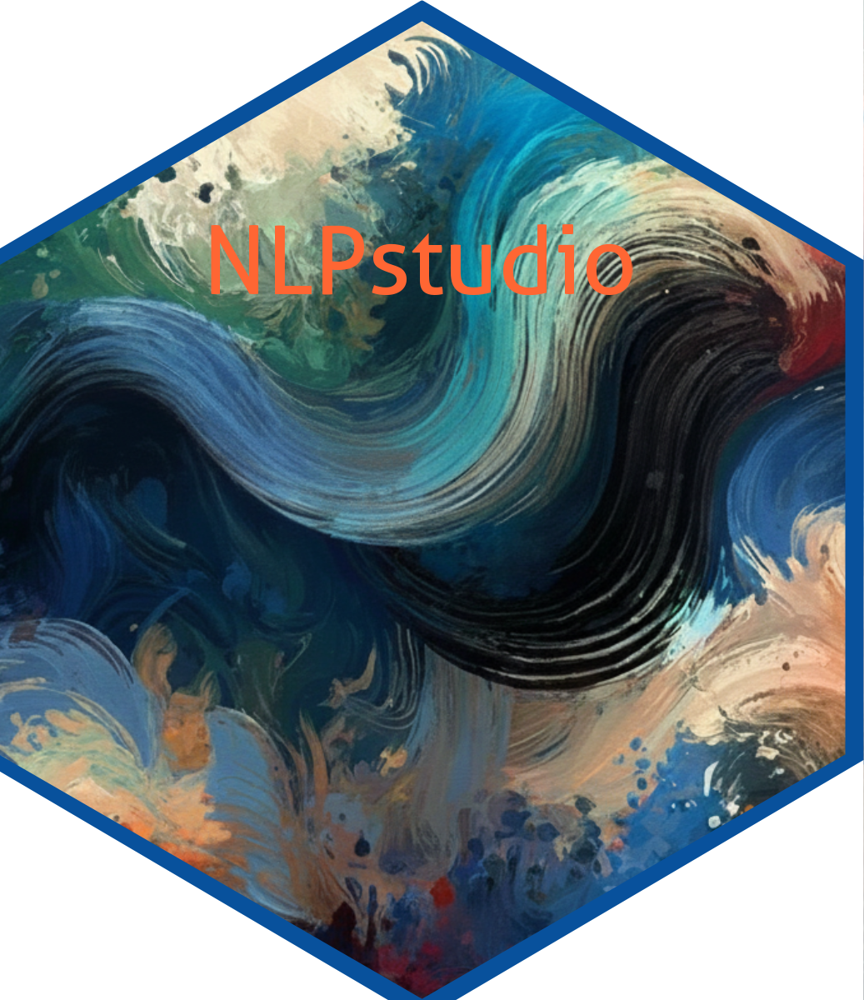

[](https://lifecycle.r-lib.org/)
[](https://github.com/contefranz/NLPstudio/actions/workflows/R-CMD-check.yaml)
[](https://app.codecov.io/gh/contefranz/NLPstudio)
[](https://github.com/contefranz/NLPstudio/releases)
[](https://en.wikipedia.org/wiki/GNU_General_Public_License)

# NLPstudio 

## Overview

**NLPstudio** is an R package that provides a high-performance, research-oriented
framework for large-scale natural language processing (NLP) on text data, 
with particular support for financial disclosures such as SEC EDGAR filings.

Built on the [**quanteda**](https://quanteda.io/) ecosystem and powered by
[**data.table**](https://rdatatable.gitlab.io/data.table/) for efficient memory
management, the package implements multicore parallelism PSOCK (portable, dynamically load-balanced) 
and FORK (Linux/macOS) backends from base R's
[**parallel**](https://stat.ethz.ch/R-manual/R-devel/library/parallel/html/00Index.html)
package.

In addition to preprocessing tasks such as tokenization, singularization,
reshaping, summarization, and similarity computations, **NLPstudio** includes a
unified topic-modeling API spanning [**text2vec**](https://cran.r-project.org/package=text2vec),
[**topicmodels**](https://cran.r-project.org/package=topicmodels), and
[**seededlda**](https://cran.r-project.org/package=seededlda), with optional
[**topicmodels.etm**](https://cran.r-project.org/package=topicmodels.etm)
support for embedded topic models. The package
standardizes document-topic weights (DTW), topic-word weights (TWW),
representative-candidate extraction, generic topic prediction for new
documents, and downstream visualization across those engines. v0.8.4 includes a
model-evaluation layer — `evaluate_topic_model()` for coherence (UMass, NPMI),
diversity, exclusivity, training NLL/perplexity, and held-out
NLL/perplexity, returned at aggregate level by default — and
`select_k_topics()` for automated grid search over candidate values of K with
an optional holdout split.

Embedded topic models are available through the optional **topicmodels.etm** and
**torch** packages when those backends are installed locally.
When ETM support is available, **NLPstudio** also exposes ETM-specific topic and
term embeddings plus a two-dimensional topic-embedding plot built on the ETM
backend UMAP summary path.

The package also provides curated **quanteda** dictionaries tailored to
financial and regulatory text, including forward-looking statements, firm
complexity, corporate social responsibility, and sustainable development themes.

Whether analyzing regulatory filings, academic corpora, or policy documents,
**NLPstudio** offers a fast and user-friendly pipeline for researchers in the
social sciences, finance, and accounting domains.

### Installation

You can install **NLPstudio** using either **devtools** or **remotes**:

```r
# with devtools
install.packages("devtools")
devtools::install_github("contefranz/NLPstudio")

# or with remotes (a lighter dependency)
install.packages("remotes")
remotes::install_github("contefranz/NLPstudio")
```

Optional ETM backend support requires both **topicmodels.etm** and a working
**torch** backend. On a clean machine, install both optional R packages and
then install the torch backend before fitting ETM models:

```r
install.packages(c("topicmodels.etm", "torch"))
torch::install_torch()
torch::torch_is_installed()
```

### Topic-model workflow

This example uses the optional **topicmodels** backend and a small in-memory
corpus so the current v0.8.4 workflow can be reproduced without external data.

```r
library(NLPstudio)
library(quanteda)

docs <- data.frame(
  doc_id = paste0("doc", 1:6),
  text = c(
    "Revenue growth improved after subscription demand increased.",
    "Operating margin expanded as cloud costs declined.",
    "Audit committee oversight focused on internal controls.",
    "Risk disclosures emphasized liquidity and refinancing pressure.",
    "Customer retention supported recurring software revenue.",
    "Debt covenants and interest expense shaped capital allocation."
  )
)

corp <- quanteda::corpus(docs, text_field = "text", docid_field = "doc_id")
toks <- quanteda::tokens(corp, remove_punct = TRUE)
toks <- quanteda::tokens_tolower(toks)
toks <- quanteda::tokens_remove(toks, pattern = quanteda::stopwords("en"))
dfm <- quanteda::dfm(toks)

fit <- fit_topic_model(
  dfm,
  engine = "topicmodels",
  model = "lda",
  k = 2,
  method = "Gibbs",
  control = list(fit = list(seed = 1L, iter = 50L, burnin = 0L, thin = 1L))
)

tww <- get_tww(fit)
get_top_terms(tww, n = 4)

evaluate_topic_model(
  fit,
  training = dfm,
  metrics = c("diversity", "exclusivity", "coherence_umass"),
  top_n = 4L
)

select_k_topics(
  dfm,
  engine = "topicmodels",
  model = "lda",
  method = "Gibbs",
  k_grid = 2:3,
  metrics = c("diversity", "exclusivity"),
  top_n = 4L,
  holdout = 0,
  seed = 1L,
  control = list(fit = list(iter = 50L, burnin = 0L, thin = 1L))
)
```

---

#### Author

[Francesco Grossetti](https://accounting.unibocconi.eu/faculty/francesco-grossetti)

_Assistant Professor of Accounting Analytics and Data Science_<br>
Department of Accounting, Bocconi University<br>
Fellow at Bocconi Institute for Data Science and Analytics ([BIDSA](https://bidsa.unibocconi.eu/))<br>
Contact: francesco.grossetti@unibocconi.it
