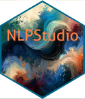

[](https://www.tidyverse.org/lifecycle/#maturing)
[](https://github.com/contefranz/edgartools/releases/tag/0.0.4)
 [](https://en.wikipedia.org/wiki/GNU_General_Public_License)

# NLPStudio 

## Overview

**NLPStudio** is a robust R package designed to facilitate the transformation of textual data into structured, analyzable corpora within the [__quanteda__](https://quanteda.io/) framework. This package offers a suite of parallel, efficient, and intuitive functions optimized for high-performance management and analysis of various textual datasets. By enhancing the processes of corpus creation, text tokenization, and data transformation, **NLPStudio** utilizes optimized R and C++ code to efficiently handle large volumes of data. 

In fact, in addition to the seamless integration with **quanteda**, **NLPStudio** also integrates 
smoothly with other R and C++ libraries, such as 
[**data.table**](https://rdatatable.gitlab.io/data.table/) for fast data processing and management and
[**future**](https://future.futureverse.org/index.html) for efficient parallel processing of large corpora.
Overall, this ecosystem of libraries ensures all text handling and processing is both rapid and precise. 
This approach allows **NLPStudio** to deliver unmatched performance and ease of use for social science 
researchers, particularly those without deep coding expertise.

While it is adept at processing diverse text sources, **NLPStudio** also includes specialized 
capabilities for managing financial disclosures, such as SEC filings, extending its applicability 
and utility in financial analytics.


## Core Functions

The functionality provided by **NLPStudio** is dynamic and may evolve:

- `create_corpus()`: The main function to create a [**quanteda**](https://quanteda.io/) corpus from
a set of JSON files.

- `reshape_corpus()`: Allows users to reshape a [**quanteda**](https://quanteda.io/) corpus in 
parallel using the [**future**](https://future.futureverse.org/index.html) paradigm for enhanced performance.

- `tokenize_corpus()`: Tokenizes a [**quanteda**](https://quanteda.io/) corpus in parallel, 
optimizing processing speed and efficiency.

- `singularize_tokens()`: Singularizes a [**quanteda**](https://quanteda.io/) tokens object via 
parallel hashing using the [**pluralize**](https://github.com/hrbrmstr/pluralize) package.

- `calculate_readability()`: Computes readability metrics for documents using
[**quanteda.textstats**](https://github.com/quanteda/quanteda.textstats) in parallel through the
[**future**](https://future.futureverse.org/index.html) framework.

- `parse_corpus()`: Parses a [**quanteda**](https://quanteda.io/) corpus in parallel with
[**spacyr**](https://github.com/quanteda/spacyr), leveraging advanced NLP techniques.

## Utility Functions

- `get_json_files()`: This function gathers all JSON files in a specified folder, creating a 
list with local pointers for easy access.

- `from_json_to_df()`: Converts JSON files into efficient 
[**data.table**](https://rdatatable.gitlab.io/data.table/) structures.

- `get_sec_master_files()`: Efficiently retrieves SEC EDGAR master files from a local directory 
for processing.

## Available Dictionaries

**NLPStudio** includes a selection of pre-compiled **quanteda** dictionaries, ideal for conducting 
bag-of-words analyses on a `tokens` object. These dictionaries pertain the fields of Accounting and 
Finance andenhance the NLP capabilities of 
**NLPStudio**, building upon the extensive resources available with
[**quanteda.sentiment**](https://github.com/quanteda/quanteda.sentiment). Currently available 
dictionaries include:

- *Loughran & McDonald Firm Complexity Dictionary*. (reference: Loughran, T. & McDonald, B. (2024). 
[Measuring Firm Complexity](https://www.cambridge.org/core/journals/journal-of-financial-and-quantitative-analysis/article/measuring-firm-complexity/D737FD0A697AF699C5AADD62842ACAB8),
*Journal of Financial and Quantitative Analysis*, 2023:1-28).

- *Li's Forward Looking Statements Dictionary*. (reference: Li, F. (2010). [The Information 
Content of Forward-Looking Statements in Corporate Filings—A Naïve Bayesian Machine Learning Approach](https://onlinelibrary.wiley.com/doi/abs/10.1111/j.1475-679X.2010.00382.x),
*Journal of Accounting Research*, 48 (5), 1049--1102).

- *Bozanic, Roulstone, and VanBuskirk Forward Looking Statements Dictionary*.
(reference: Bozanic, Z., Roulstone, D.T., Van Buskirk, A. (2018), [Management earnings forecasts and other 
forward-looking statements](https://www.sciencedirect.com/science/article/abs/pii/S0165410117300733), *Journal of Accounting and Economics*, Volume 65, Issue 1, 2018,
Pages 1-20).

- *Cannon, Ling, Wang, and Watanabe CSR Dictionary*.
(reference: Cannon, J. N., Ling, Z., Wang, Q., & Watanabe, O. V. (2020).
[10-K disclosure of corporate social responsibility and firms’ competitive advantages](https://www.tandfonline.com/doi/epdf/10.1080/09638180.2019.1670223?src=getftr).
_European Accounting Review_, 29(1), 85-113).

- *U.N. Sustainable Development Goals (SDG) Mapping Dictionary*.
(reference: Wang, W., Kang, W., & Mu, J. (2023). 
[Mapping research to the sustainable development goals](https://assets.researchsquare.com/files/rs-2544385/v3/de08997f5c48f22a37cc4f93.pdf?c=1678389566),
_Working Paper_.

Probably, more dictionaries will be added in future releases. 


## Optimal Usage

What follows is a simple example of _good practice_. The script processes one year only on purpose as
this pipeline can easily be inserted in a bigger codebase and vectorized. Or, one can control 
the initial parameter and launch the code via the RStudio Background Jobs tab or with the regular
`rscript` terminal command. 

```r
library(data.table)
library(NLPStudio)
library(stringr)
library(quanteda)
library(quanteda.textstats)
library(qs)
library(cli)


# SET THE PARAMETERS --------------------------------------------------------------------------

root_path = "edgar-crawler/datasets/" # root path to search for JSONs
filing_year = 2007                    # filing year to process
ncores = 2                            # cores for parallel backend with foreach and future
nthreads = 2                          # threads for writing .qs files on disk
corpus_folder = "quanteda_corpus"     # corpus storing folder
tokens_folder = "quanteda_tokens"     # tokens storing folder


# CORPUS CREATION PIPELINE --------------------------------------------------------------------

# 1. Initial collection of all the JSON files processed by extract_filings.py
# This returns a list whose length is equal to the follow up time passed to fyear.
# Each list element contains the pointers to the raw json files as detected in each fyear directory.
cli_h1("Collecting JSON files")
json_container = get_json_files(root_path, pattern = "ITEMS", fyear = filing_year)

# 2. This reads the json files and converts them to data.table. It returns a list.
# Each list element is a data.table containing information about the filing in addition to the raw text.
cli_h1("Converting JSONs to data.table objects")
df_container = from_json_to_df(json_list = json_container, ncores = ncores, bind = TRUE)

# 3. create the corpus
cli_h1("Creating the quanteda corpus")
current_corpus = create_corpus(df_container = df_container)

if ( !dir.exists(corpus_folder) ) {
  dir.create(corpus_folder)
}

cli_h1("Saving the corpus")
fileout = str_c("quanteda_corpus_", filing_year, ".rds")
qsave(current_corpus, file = file.path(corpus_folder, fileout), nthreads = nthreads)

cli_alert_success("Corpus correctly saved!")

# TOKENIZATION --------------------------------------------------------------------------------

# 4. Tokenize the corpus
toks = tokenize_corpus(x = current_corpus,
                       ncores = 2,
                       remove_separator = FALSE,
                       remove_punct = TRUE,
                       remove_symbols = TRUE,
                       remove_numbers = FALSE)

cli_h1("Saving the corpus")
fileout = str_c("quanteda_tokens_", filing_year, ".qs")
qsave(toks, file = file.path(tokens_folder, fileout), nthreads = nthreads)

cli_alert_success("Corpus correctly saved!")

# SINGULARIZE TOKENS --------------------------------------------------------------------------

toks_single = singularize_tokens(x = toks,
                                 ncores = 8, 
                                 remove_numbers = TRUE,
                                 min_char = 3)

# CALCULATE READABILITY -----------------------------------------------------------------------

fog_index = calculate_readability(x = current_corpus,
                                  ncores = ncores,
                                  measure = "FOG")


# PARSE CORPUS WITH SPACY ---------------------------------------------------------------------

parsed = parse_corpus(x = current_corpus,
                      ncores = ncores,
                      pos = TRUE,
                      entity = FALSE)

# END OF SCRIPT
```

## Author

* [Francesco Grossetti](https://accounting.unibocconi.eu/people/francesco-grossetti) 

  Assistant Professor of Accounting Analytics and Data Science  
  Bocconi Institute for Data Science and Analytics ([BIDSA](https://www.bidsa.unibocconi.eu/wps/wcm/connect/Site/Bidsa/Home))  
  Accounting Department, Bocconi University.  
  Contact Francesco at: francesco.grossetti@unibocconi.it.  
